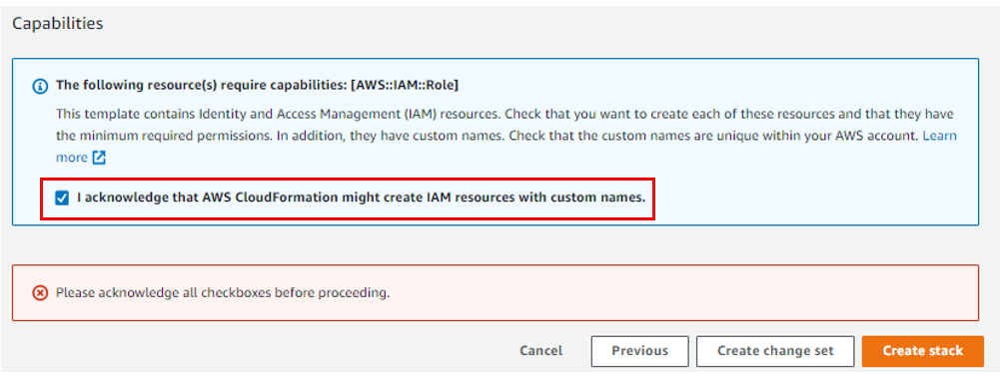

# AWS DevOps - Integrate GitHub Actions with AWS CodeDeploy to deploy a Web App to Amazon EC2 instance.

Welcome to my AWS DevOps Project where I have used GitHub Actions to create a CI/CD workflow and used AWS Code Deploy to deploy a very basic Java SpringBoot application to EC2 instances in an Autoscaling group.

## Goal - Automation
The main goal of this project is to implement Continuous Integration and Continuous Delivery (CI/CD) tooling as this practice drastically reduces the time to release new software updates by automating deployment activities.

## Quick facts on Github Actions and AWS Code Deploy

GitHub Actions - This is an amazing feature on GitHub's platform that helps one to automate software development workflows in the same place where code is stored. Workflows are custom automated processes that one can set up in their reporsitory to build, test, package, release or deploy any code on GitHub. 

AWS CodeDeploy - It is deployment service that automates application deployments to EC2 instances, ECS (Containers), On-prem instances and Serverless Lambda Functions. 

## Key Learnings and Takeaways!!
1.    Build AWS Core Infrastructure with the AWS infrastructure as code (IaC) service called AWS CloudFormation.
2.    Integrate Github Actions with AWS Code Deploy to manage deployments on EC2 Autoscaling group. 

## Pre-requisties for this Project
1.   An AWS Account with permissions to create necessary resources
2.   A GitHub Account with permissions to configure GitHub repositories, create workflows and configure Github Secrets.
3.   VS Studio Code 2019

## Solution Achitecture

## Step by Step Approach

### Stage 1 - Download the source code by cloning the source code repository.

     git clone https://github.com/aws-samples/aws-codedeploy-github-actions-deployment.git

Now, create an empty repository in your personal Github Account. In my case, I created a Github repository by the name "AWSDevOpsGithubActions".
Clone this repoistory to your PC.

     git clone https://github.com/njagwani/AWSDevOpsGithubActions.get

### Stage 2 - Copy the code to your repository for Github actions to work.
     cp -r aws-codedeploy-github-actions-deployment/. AWSDevOpsGitHubActions

You should have the a similar directory structure in your local repository as seen below.

### Stage 3 - Deploy the CloudFormation Stack

On the AWS Console, navigate to search bar and type "Cloud formation template". Click on create "Stack", Select the option "upload a template" and choose the template.yaml file which can be found under cloud formation directory of this Github repo. Click on Next. 

Enter the following details as seen below:

     - Stack Name = CodeDeployStack
     - VPV Configurations = Taken from the template and should be pre-populated after uploading the template.yaml file. 

     - GithubRepoName = njagwani/AWSDevOpsGitHubAactions
     - ThumbprintList = 6938fd4d98bab03faadb97b34396831e3780aea1

Click on Next

Ackowledge the box for AWS Cloud formation template to create IAM resources

You will now see that Cloud Formation template is creating all the resources which were specified in the template.yaml file. 

The Resources include the following:

1.    Two EC2 Linux Instances with Tomcat Server and Code Deploy installed
2.    Autoscaling group with Internet Application load balancer
3.    CodeDeploy application name and deployment group
4.    S3 bucket to store build artifacts
5.    Identity and Access Management (IAM) OIDC identity provider
6.    Instance profile for Amazon EC2 
7.    Service role for CodeDeploy
8.    Security groups for ALB and Amazon EC2

In the screenshot below, you can see all the resources that are being created.

Navigate to the output section of the Cloud Formation Stack and copy the Deployment Bucket Value and GithubIAMRoleARN as seen below.

Naviagte to your aws/scripts directory, locate the file "after-install.sh". Replace the bucket name with your Deployment Bucket Value as seen below and save it.

Navigate to worflows directory, locate the file "deploy.yml". Replace the AWS_REGION as your current region "us-east-1" and S3 Bucket name to be the Deployment Bucket Value which was seen on the outputs of the Cloud Formation Stack. Be sure to save it. 

Now run the below commands to push the changes:

     git add .

     git commit -m "updates to aws scripts and workflows"

     git push

### Stage 4 - Setup Github Secrets

- Navigate to your Github repository. Click on Settings Tab & Select the Secrets Drop down. Click on Actions.
- Select New Repository Secret
- Enter the Secret name as "IAMROLE_GITHUB"
- Copy the value of GithubIAMRoleARN from Output section of Cloud Formation Stack and Paste it here. Click on Update Secret.

## Stage 5 - Integrate CodeDeploy with GitHub

Now, that we have configured Guthub Secrets, we need to integrate CodeDeploy with GitHub.
This can be done by following the below steps:
1. Navigate to AWS Console, Search for "CodeDeploy".
2. On the Left side, Under Deploy, Select Applications
3. Then click on Deploy application
4. Enter the GithubIAMRoleARN Number in the Github token name
5. Click on "Connect to GitHub"
6. You will the see a pop-up window requesting to Sign into GitHub to continue to AWS CodeDeploy, enter your credentials and select sign-in. 

## Stage 6 - Trigger the GitHub Actions Workflow

Navigate to Github Actions under your repository. GitHub Actions is defined in the GITHUBREPO/.github/workflows/deploy.yml which would run the workflow. 

Since workflow is set to be manually run, follow the below steps to triger the workflow.

1.    Go to your Github Repo, Select Actions Tab
2.    Select Build and Deploy, then click on Run workflow on the right side.
3.    You will then see that workflow "Build and Deploy" has been triggered. It contains 2 jobs - Build and Package; Deploy
4.    In the screeshot below, you can see that job was executed successfully. 
5.    Build and Package stage builds the SpringBoot Application, generates a war file which is then uploaded to S3 bucket. 
6.    War file is seen in the Amazon S3 Bucket
7.    In the Deploy stage, workflow should have invoked the CodeDeploy Service and triggered the deployment. 
8.    Navigate to CodeDeploy on AWS Console, you will see that Deployment succeeded for Deployment Group "CodeDeployGroupName"
9.    Go to the output section of the cloud formation stack to obtain the URL of the Application Load Balancer. Copy the URL
10.   Paste in a web browser.
11.   You can now see that web page of sample Spring Boot Application. 

Cheers!

Nitin Jagwani
 

